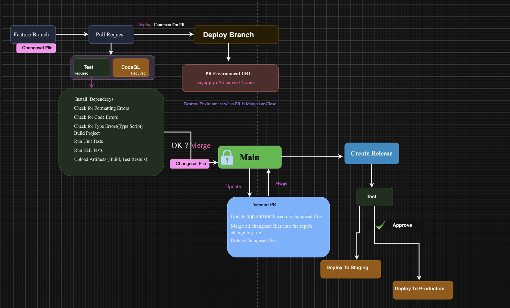

# GitHub Actions Workflow Documentation For this Nextjs project 




## CI Workflow

The CI workflow is triggered on pull requests to the `main` branch. It uses concurrency to group workflows based on the GitHub workflow and pull request number, allowing cancellation of in-progress workflows when a new one is triggered.

```yaml
name: CI
on:
  pull_request:
    branches: [main]

concurrency:
  group: ${{ github.workflow }}-${{ github.event.pull_request.number }}
  cancel-in-progress: true

jobs:
  run-tests:
    uses: ./.github/workflows/test.yaml
    secrets: inherit

```

# Test Workflow

The Test workflow is triggered on a workflow call.

```yaml
name: Test
on: workflow_call

jobs:
  test-and-build:
    runs-on: ubuntu-latest
    steps:
      - name: checkout
        uses: actions/checkout@v3
      - name: setup environment
        uses: actions/setup-node@v3
        with:
          node-version: 18
          cache: npm
      - name: install dependencies
        run: npm ci
      - name: Check for Formatting Errors
        run: npm run format
      - name: Check for ESLint Errors
        run: npm run lint
      - name: Check for Type Errors
        run: npm run typecheck
      - name: Build Project
        run: npm run build
      - uses: actions/upload-artifact@v3
        with:
          name: build
          path: .next/
      - name: Run Unit Tests
        run: npm run test
      - uses: actions/upload-artifact@v3
        if: always()
        with:
          name: coverage
          path: coverage/
      - name: Upload coverage reports to Codecov
        uses: codecov/codecov-action@v3
        env:
          CODECOV_TOKEN: ${{ secrets.CODECOV_TOKEN }}
      - name: Store Playwright's Version
        run: |
          PLAYWRIGHT_VERSION=$(npm ls @playwright/test | grep @playwright | sed 's/.*@//')
          echo "Playwright's Version: $PLAYWRIGHT_VERSION"
          echo "PLAYWRIGHT_VERSION=$PLAYWRIGHT_VERSION" >> $GITHUB_ENV
      - name: Cache Playwright Browsers
        uses: actions/cache@v3
        id: cache-playwright
        with:
          path: ~/.cache/ms-playwright
          key: playwright-browsers-${{ env.PLAYWRIGHT_VERSION }}
      - name: Install Playwright Browsers
        run: npx playwright install --with-deps
      - name: Run E2E Tests
        run: npm run test:e2e
      - uses: actions/upload-artifact@v3
        if: always()
        with:
          name: playwright-report
          path: playwright-report/
      - name: Send a Slack Message on Failure
        uses: slackapi/slack-github-action@v1.24.0
        if: failure()
        with:
          payload: |
            {
              "blocks": [
                {
                  "type": "section",
                  "text": {
                    "type": "mrkdwn",
                    "text": "🛑 *[GitHub Actions Workflow Run](https://github.com/${{github.repository}}/actions/runs/${{ github.run_id }})* failed."
                  }
                }
              ]
            }
        env:
          SLACK_WEBHOOK_URL: ${{ secrets.SLACK_WEBHOOK_URL }}
          SLACK_WEBHOOK_TYPE: INCOMING_WEBHOOK
```


# Workflow Steps Overview

1. **Checkout:** Check out the source code.
2. **Setup Environment:** Set up the Node.js environment with version 18 and cache npm dependencies.
3. **Install Dependencies:** Install project dependencies using npm.
4. **Check for Formatting Errors:** Run a script to check for formatting errors.
5. **Check for ESLint Errors:** Run a script to check for ESLint errors.
6. **Check for Type Errors:** Run a script to check for TypeScript type errors.
7. **Build Project:** Build the project using npm.
8. **Run Unit Tests:** Execute unit tests using npm.
9. **Upload Build Artifact:** Upload the build artifacts (in the `.next/` directory).
10. **Upload Coverage Reports to Codecov:** Upload coverage reports to Codecov using the Codecov GitHub Action.
11. **Store Playwright's Version:** Extract Playwright's version from the project dependencies and store it in the environment variables.
12. **Cache Playwright Browsers:** Cache Playwright browsers to speed up subsequent runs.
13. **Install Playwright Browsers:** Install Playwright browsers with dependencies.
14. **Run E2E Tests:** Execute end-to-end tests using npm.
15. **Upload Playwright Report Artifact:** Upload the Playwright test report artifact.
16. **Send Slack Message on Failure:** Send a Slack message in case of workflow failure, providing a link to the GitHub Actions workflow run.

**Note:** This workflow assumes the presence of certain secrets like `CODECOV_TOKEN` and `SLACK_WEBHOOK_URL` in your GitHub repository secrets. Ensure that these secrets are properly configured in your repository settings.


# CD Workflow

The CD (Continuous Deployment) workflow is triggered on pushes to the `main` branch. It supports concurrency to manage multiple deployments simultaneously.

```yaml
name: CD
on:
  push:
    branches: [main]

concurrency:
  group: ${{github.workflow}}-${{github.ref}}
  cancel-in-progress: true

jobs:
  create-version-pr-or-release:
    runs-on: ubuntu-latest
    outputs:
      should-deploy: ${{steps.changesets.outputs.hasChangesets == 'false'}}
    steps:
      # ... (Steps omitted for brevity)

  run-tests:
    needs: create-version-pr-or-release
    if: needs.create-version-pr-or-release.outputs.should-deploy == 'true'
    uses: ./.github/workflows/test.yaml
    secrets: inherit

  deploy-to-staging:
    needs: run-tests
    permissions:
      pull-requests: write
    uses: ./.github/workflows/deployment.yaml
    secrets: inherit
    with:
      aws-env: ${{vars.AWS_EB_STAGING_ENV}}
      github-env: "staging"

  deploy-to-production:
    needs: run-tests
    permissions:
      pull-requests: write
    uses: ./.github/workflows/deployment.yaml
    secrets: inherit
    with:
      aws-env: ${{vars.AWS_EB_PRODUCTION_ENV}}
      github-env: "production"


# Deploy Workflow

The Deploy workflow is triggered either by a manual workflow dispatch or as part of a workflow call. It allows deploying to different AWS Elastic Beanstalk environments.

```yaml
name: Deploy
on:
  workflow_dispatch:
    inputs:
      aws-env:
        description: "AWS Elastic Beanstalk Environment"
        required: true
        default: "staging"
        type: string
      github-env:
        description: "GitHub Environment"
        required: true
        default: "staging"
        type: string
      report-pr:
        description: "PR to add report comments to"
        type: number
  workflow_call:
    inputs:
      aws-env:
        description: "AWS Elastic Beanstalk Environment"
        required: true
        default: "staging"
        type: string
      github-env:
        description: "GitHub Environment"
        required: true
        default: "staging"
        type: string

concurrency:
  group: ${{ github.workflow }}-${{ github.ref }}-${{ inputs.aws-env }}-${{ inputs.github-env }}
  cancel-in-progress: true

jobs:
  deploy:
    runs-on: ubuntu-latest
    permissions:
      pull-requests: write
      id-token: write
    environment:
      name: ${{ inputs.github-env }}
      url: "http://${{ steps.get-env-cname.outputs.aws_env_cname }}"
    steps:
      # ... (Steps omitted for brevity)
```


# Workflow Structure: Deploy

**Trigger:** The workflow can be triggered either manually or as part of a workflow call.

**Inputs:**

- `aws-env`: AWS Elastic Beanstalk Environment (required, default: "staging")
- `github-env`: GitHub Environment (required, default: "staging")
- `report-pr`: PR number to add report comments (optional, type: number)

**Concurrency:** The workflow has concurrency control to avoid conflicts between multiple runs.

**Jobs:**

- **deploy:**
  - **Runs on:** Ubuntu latest with specific permissions for pull requests and ID token.
  - **Environment:** Associated with a specific environment.
  - **URL:** Dynamically set based on the AWS Elastic Beanstalk environment's CNAME.

*Note: Steps within the job are omitted for brevity. Customize the workflow to fit your specific deployment requirements and configure necessary secrets such as `CHANGESETS_TOKEN`, `SLACK_WEBHOOK_URL`, and others in your GitHub repository.*


# PR Comment Workflow

The PR Comment workflow is triggered when a pull request is opened.

```yaml
name: PR Comment
on:
  pull_request_target:
    types: [opened]

jobs:
  add-deployment-info-comment:
    runs-on: ubuntu-latest
    permissions:
      pull-requests: write
    steps:
      - name: Add Deployment Info Comment
        uses: actions/github-script@v6
        with:
          script: |
            github.rest.issues.createComment({
                issue_number: context.issue.number,
                owner: context.repo.owner,
                repo: context.repo.repo,
                body: 'Comment with `/deploy` to deploy to a new staging environment and `/destroy` to destroy the staging environment'
            })
```


# Workflow Description: Automated Pull Request Comment

This workflow automatically adds a comment to a newly opened pull request. The comment provides instructions to use `/deploy` for deploying to a new staging environment and `/destroy` for destroying the staging environment.

Feel free to customize the comment message or adjust the workflow according to your specific needs. Ensure that the necessary permissions and configurations are set up in your GitHub repository.


# Destroy PR Environment Workflow

The Destroy PR Environment workflow is triggered when a comment is created with `/destroy` on a pull request or when the pull request is closed.

```yaml
name: Destroy PR Environment
on:
  issue_comment:
    types: [created]
  pull_request_target:
    types: [closed]

jobs:
  destroy-pr-env:
    if: (github.event.issue.pull_request && github.event.issue.state == 'open' && github.event.comment.body == '/destroy') || github.event_name == 'pull_request_target'
    runs-on: ubuntu-latest
    permissions:
      id-token: write
      deployments: write
      pull-requests: write
    steps:
      - name: Configure AWS Credentials
        uses: aws-actions/configure-aws-credentials@v4
        with:
          role-to-assume: arn:aws:iam::163339513858:role/gh-next-beanstalk
          aws-region: ${{ vars.AWS_REGION }}

      - uses: actions/cache@v3
        with:
          path: ~/.cache/pip
          key: ${{ runner.os }}-pip
      - name: Install EB CLI
        id: install-eb-cli
        run: pip install awsebcli

      - name: Initialize EB
        run: eb init ${{vars.AWS_EB_APP_NAME}} --platform ${{vars.AWS_EB_PLATFORM}} --region ${{vars.AWS_REGION}}

      - name: Get AWS ENV Name
        id: get-env-name
        run: echo "aws_env=$(aws elasticbeanstalk describe-environments --application-name ${{vars.AWS_EB_APP_NAME}} --environment-names github-actions-course-demo-pr-${{ github.event.issue.number || github.event.pull_request.number }} --query "Environments[0].EnvironmentName" --output text)" >> $GITHUB_OUTPUT

      - name: Get AWS ENV Status
        id: get-env-status
        run: echo "aws_env_status=$(aws elasticbeanstalk describe-environments --application-name ${{vars.AWS_EB_APP_NAME}} --environment-names github-actions-course-demo-pr-${{ github.event.issue.number || github.event.pull_request.number }} --query "Environments[0].Status" --output text)" >> $GITHUB_OUTPUT

      - name: Decide if Environment Needs to be Terminated
        id: check-env
        run: echo "should_terminate=${{  steps.get-env-name.outputs.aws_env != 'None' && steps.get-env-status.outputs.aws_env_status != 'Terminated' }}" >> $GITHUB_OUTPUT

      - name: Destroy Environment
        if: steps.check-env.outputs.should_terminate == 'true'
        run: eb terminate ${{ steps.get-env-name.outputs.aws_env }} --force

      - name: Get Pull Request Head Ref
        if: github.event_name == 'issue_comment' && steps.check-env.outputs.should_terminate == 'true'
        id: get-head-ref
        uses: actions/github-script@v6
        with:
          result-encoding: string
          script: |
            const response = await github.rest.pulls.get({
                owner: context.repo.owner,
                repo: context.repo.repo,
                pull_number: context.issue.number
            });
            return response.data.head.ref

      - name: Get deployment ID
        if: steps.check-env.outputs.should_terminate == 'true'
        uses: actions/github-script@v6
        id: get-latest-deployment
        with:
          result-encoding: string
          script: |
            const response = await github.rest.repos.listDeployments({
              owner: context.repo.owner,
              repo: context.repo.repo,
              ref: "${{ github.event.pull_request.head.ref || steps.get-head-ref.outputs.result  }}",
              per_page: 1
            });
            return response.data.length > 0 ? response.data[0].id : ""

      - name: Add Inactive Status
        if: steps.get-latest-deployment.outputs.result != '' && steps.check-env.outputs.should_terminate == 'true'
        uses: actions/github-script@v6
        with:
          script: |
            const response = await github.rest.repos.createDeploymentStatus({
              owner: context.repo.owner,
              repo: context.repo.repo,
              deployment_id: ${{ steps.get-latest-deployment.outputs.result }},
              state: 'inactive',
            });
            console.log(response)

      - name: Update Pull Request (Failure)
        uses: actions/github-script@v6
        if: failure() && steps.check-env.outputs.should_terminate == 'true'
        continue-on-error: true
        with:
          script: |
            const comment = `### 🛑 Environment Termination Failed.

            [View Logs](https://github.com/${{ github.repository }}/actions/runs/${{ github.run_id }})`

            github.rest.issues.createComment({
              owner: context.repo.owner,
              repo: context.repo.repo,
              issue_number: ${{ github.event.issue.number || github.event.pull_request.number }},
              body: comment
            })

      - name: Update Pull Request (Success)
        uses: actions/github-script@v6
        if: success() && steps.check-env.outputs.should_terminate == 'true'
        continue-on-error: true
        with:
          script: |
            const comment = `### ✅ Environment Terminated Successfully.`

            github.rest.issues.createComment({
              owner: context.repo.owner,
              repo: context.repo.repo,
              issue_number: ${{ github.event.issue.number || github.event.pull_request.number }},
              body
```